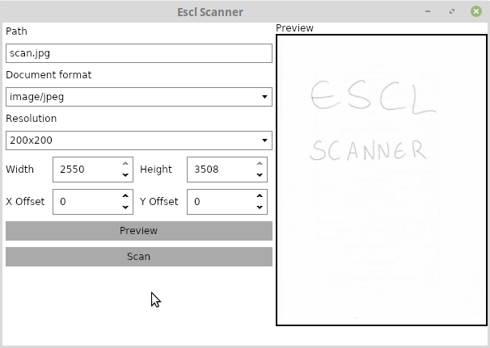

# eSCL Scan Tool

This is an app for easy Wi-Fi scanning from devices providing communication via eSCL protocol (e.g. HP LaserJet Pro MFP M28w).

## References

- https://github.com/petrj/HPWifiScan/
- https://github.com/kno10/python-scan-eSCL
- https://mamascode.wordpress.com/2015/04/07/scanning-from-wifi-hp-scanner/
- http://testcluster.blogspot.com/2014/03/scanning-from-escl-device-using-command.html
